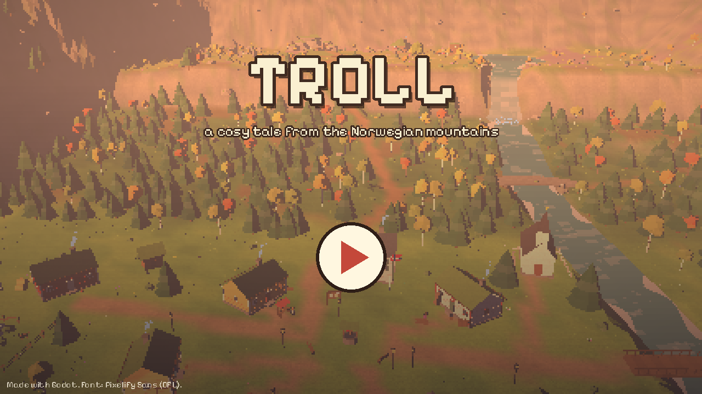
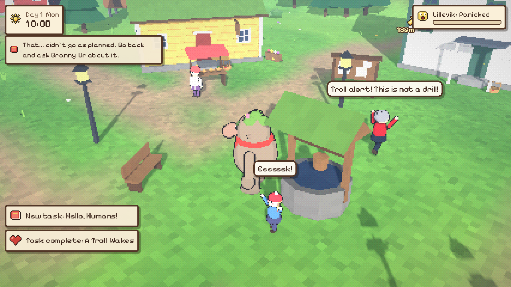
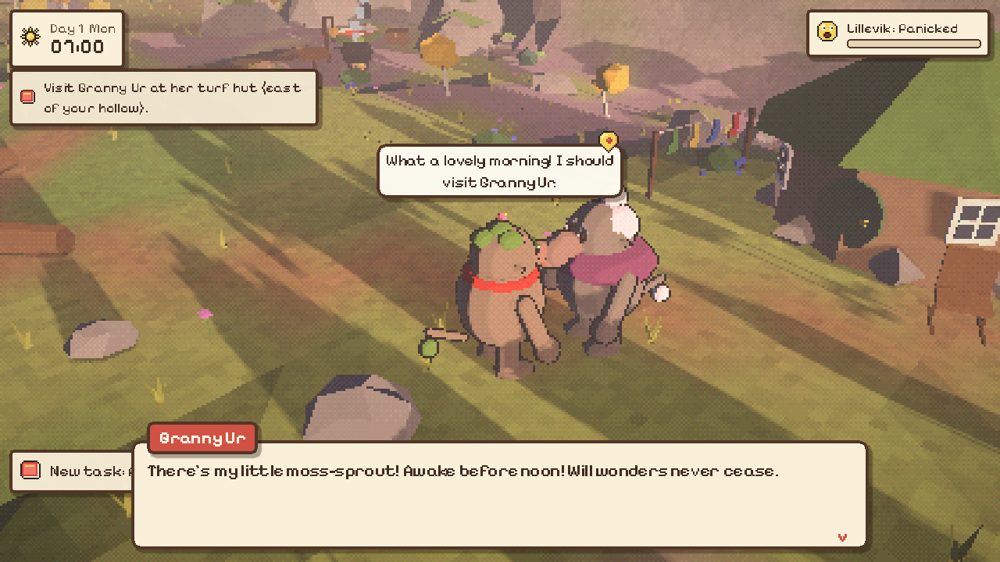
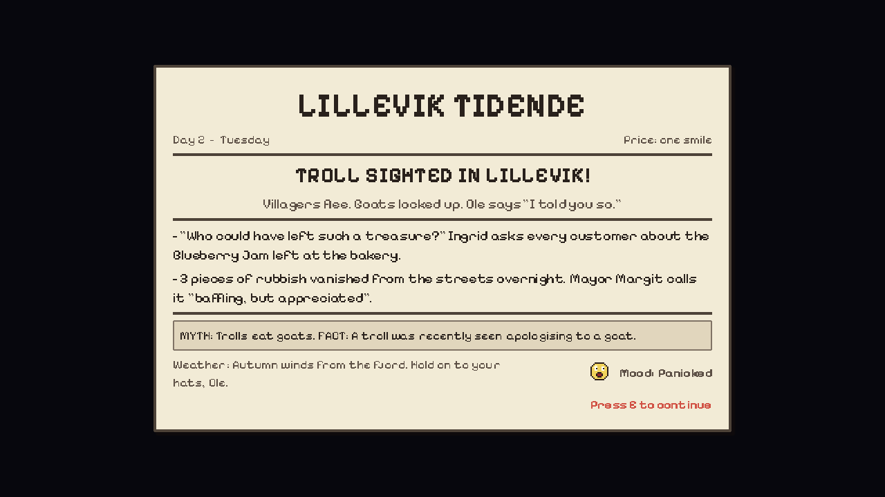
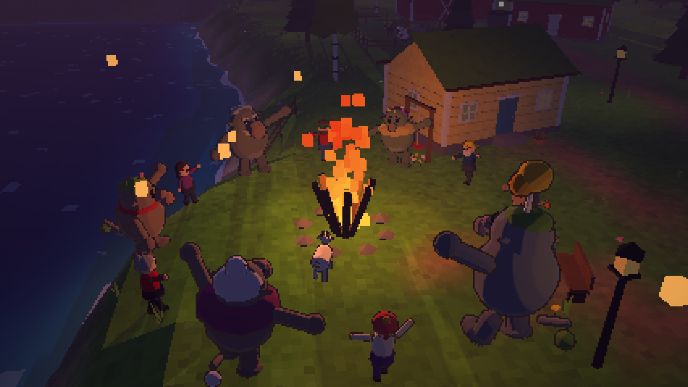
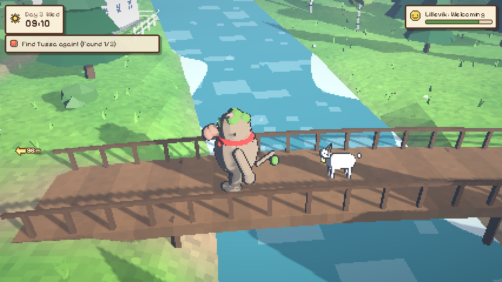
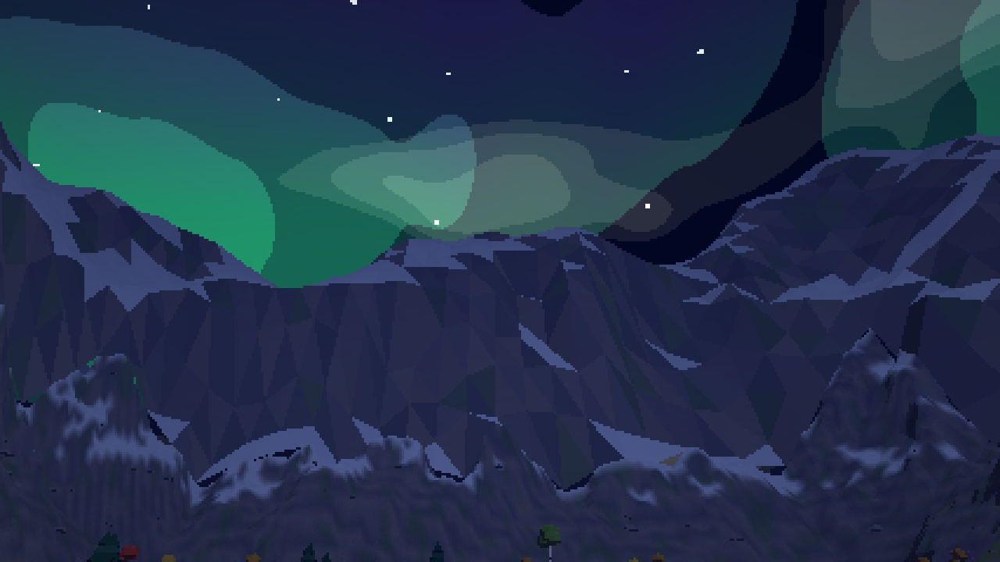
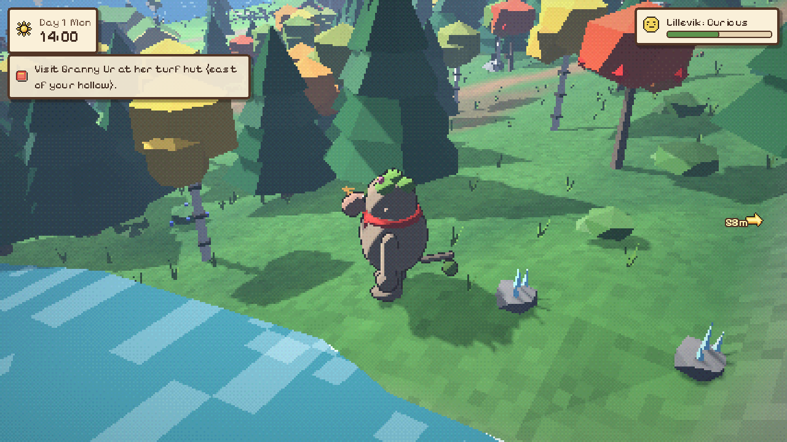
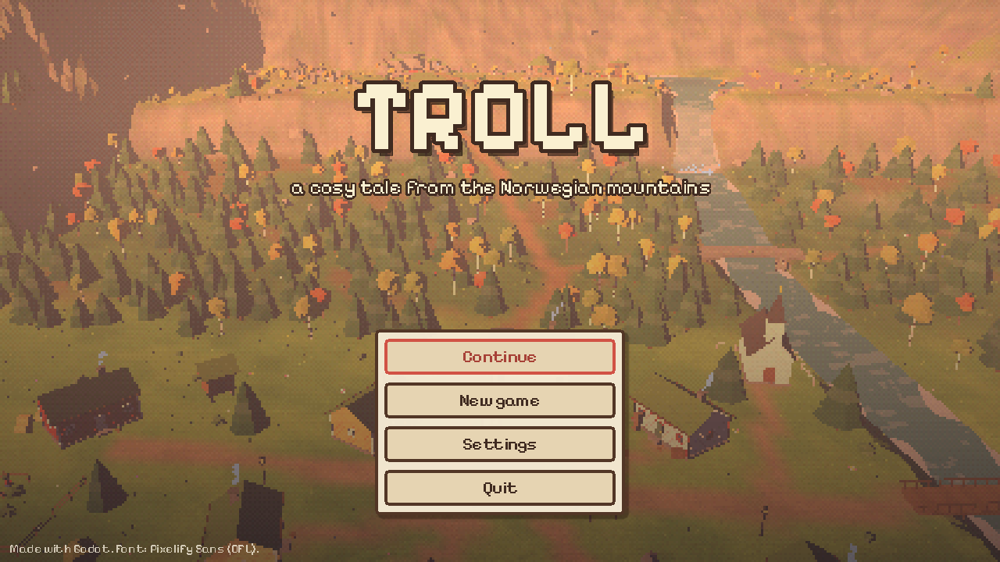

# TROLL — a cozy tale from the Norwegian mountains

A cozy 3D pixel-art game made with **Godot 4**. You are a gentle young troll living
on **Trollfjell**, high above the little fjord village of **Lillevik**. You love moss,
blueberries and the smell of rain on warm stones, and more than anything you want
to be friends with the humans below.

There's just one problem: whenever a human sees you, they scream and run away.
You have *no idea why*.

Help out in secret: leave little gifts on doorsteps, tidy up the village at night,
lift boulders no human could move and find lost things. Every morning the village
paper, *Lillevik Tidende*, reports on the mysterious helper, and slowly the
villagers start to wonder whether trolls are so scary after all.

You can't die or lose. There's no money and no timer. It's just you, your troll
friends, and a village that needs to get to know you.

[](docs/trailer.mp4)

**[▶ Watch the gameplay trailer (1:41)](docs/trailer.mp4)**

| | |
|---|---|
|  |  |
|  |  |
|  |  |
|  |  |

## Running the game

1. Install **Godot 4.4 or newer**. It was developed and tested with Godot 4.7.2.
   Use the standard build; you don't need the .NET version.
2. Open Godot, choose **Import**, and select this folder's `project.godot`.
3. Press **F5** (or the ▶ Play button).

The first launch takes a second or two while the valley is generated. Your
progress saves automatically every time you sleep, and you can also save from
the pause menu.

To make a standalone build, use *Project → Export* after installing the export
templates.

## Controls

| Action | Keyboard / mouse | Gamepad |
|---|---|---|
| Move | WASD / arrow keys | Left stick / D-pad |
| Run | Shift | RB / B |
| Interact / talk / continue | E, Space or Enter | A |
| Rotate camera | Z / C, or drag with the right mouse button | Right stick left/right, LB |
| Tilt camera (look up at the stars) | R / F, Page Up / Page Down, or drag up/down | Right stick up/down |
| Zoom | Mouse wheel, + / - | |
| Bag (inventory) | Tab or I | Y |
| Journal | J | X |
| Pause menu | Esc | Start |
| Fullscreen | F11 | |

## How to play

**Time.** A day runs from 06:00 to 02:00 and takes about 16 real minutes. Time
pauses while you talk or browse menus. Sleep in the moss bed in your hollow to
end the day. If you stay up past 02:00 you'll yawn your way home automatically.

**Foraging.** Blueberries, lingonberries, cloudberries (in the bog), chanterelles,
wildflowers, heather, moss, pinecones, pretty stones, crystals, feathers and
driftwood grow back every day or two.

**Cooking.** Use the cauldron in your hollow. Your troll friends teach you 8
recipes: jams, cloudberry cream, mushroom soup, heather tea, bouquets, moss
pillows and troll carvings.

**Making friends with humans.** Every villager has a trust level:

| Stage | What they do |
|---|---|
| Terrified | Scream and run home when you get close |
| Scared | Keep their distance and tremble, but accept a gift |
| Wary | Will talk to you, nervously |
| Curious | Ask questions and give you tasks |
| Friendly | Wave and say hello, and sometimes give you treats |
| Friend | A true friend |

Ways to build trust:
- **Doorstep gifts.** Each house has a small basket by the door. Gifts left
  there are found the next morning.
- **Tidying litter** around the village. Someone usually notices.
- **Gifts in person and a daily chat**, once they stop running away.
- **Favourite things.** Everyone has items they love. Your journal remembers
  them once you're close.
- **Big troll jobs** that only you can do.

**Favours.** From day 2, friends ask for things in the morning, Animal Crossing
style. Deliver them for thanks and treats.

**The journal (J)** lists your tasks, friendships, how the village feels about
you, and your recipes. A yellow marker (or an edge arrow showing the distance)
points to your current goal.

## Characters

**Trolls of Trollfjell**
- **Granny Ur** is 900 years old and knits constantly. "Kindness is like moss."
- **Stein** is huge, collects rocks, and has a tiny birch tree growing on his head.
- **Tussa** is Granny's grandchild, full of questions and *very* good at hiding.
- **Lyng** is a gentle gardener who lives in a hollow tree stump.
- **Gubben Grå** has guarded the old stone bridge for 300 years. His
  great-great-grandfather once had a disagreement with three goats.

**People of Lillevik**
- **Ingrid** is the baker and dreams of real bog cloudberries.
- **Ole** is an old fisherman who knows every troll story. He is the hardest to win over.
- **Astrid** is eight and three quarters. She's fearless, mostly.
- **Lars** is a goat farmer. "Uff da!"
- **Solveig** runs the shop and carries all the village gossip.
- **Mayor Margit** runs the village and has a very serious notebook.

The story has eight chapters, from *A Troll Wakes* to *The Harvest Festival*,
plus side tasks: hide and seek, a pillow for a bridge troll, a lost lucky hat,
a jam taste test and more. After the festival, life on the mountain goes on.

## Under the hood

The game doesn't use any pre-made art. Everything is generated from code:

- **World:** a designed height field (fjord, village, forested slope, escarpment
  with a waterfall, troll plateau, lake and bog), carved paths and river,
  vertex-coloured low-poly terrain, and mountains in the distance
  (`scripts/world/terrain.gd`, `layout.gd`).
- **Look:** the 3D scene renders into a low-resolution `SubViewport`, which is
  scaled up with nearest filtering at an integer factor. A post shader adds
  colour grading and ordered dithering. The game uses cel-shaded materials,
  inverted-hull outlines on characters, stylised water with shore foam, and a
  sky shader with sun, moon, stars, clouds and northern lights. The *Pixel size*
  setting (Chunky / Cosy / Fine) changes the resolution.
- **Characters:** built from primitive shapes and animated procedurally
  (`scripts/actors/character_model.gd`).
- **Icons:** 16×16 pixel art written as ASCII in `scripts/data/icons.gd`.
- **Audio:** music and sound effects are synthesised by `tools/gen_audio.py`
  (Karplus-Strong strings, music-box bells, flute, fiddle and reverb), plus
  animal-crossing style voice blips.
- **Content:** items, characters, dialogue and quests are data in
  `scripts/data/`.

```
scenes/main.tscn        entry scene (scripts/main.gd)
scripts/autoload/       Game (state, quests, saving) and Sound
scripts/world/          terrain, water, vegetation, buildings, day/night, interactables
scripts/actors/         player, NPCs, animals, camera, character models
scripts/story/          conversations, gifts, sleep & newspaper, festival
scripts/ui/             HUD, dialogue, bag, journal, cauldron, paper, menus, theme
scripts/data/           items, icons, NPCs, quests
shaders/                toon, outline, water, sky, post-process
tools/                  audio generator, trailer recorder, terrain/icon preview scripts
tests/                  automated playthrough, walkability test, screenshot tour, trailer
```

### Automated tests

Run these from the project folder with a Godot 4 binary. A display is needed;
on a headless server, use `xvfb-run`.

```sh
godot --path . -- --autotest            # plays the whole story and checks every chapter completes
godot --path . -- --autotest --shots    # ...and saves screenshots to the user data folder
godot --path . -- --walktest            # walks the main routes with real input to check they're passable
godot --path . -- --tour                # screenshots of key places at different times of day
```

### Recording the trailer

`tests/trailer.gd` is a scripted camera and gameplay sequence. `tools/make_trailer.sh`
records it with Godot's Movie Maker mode (30 fps, 1280×720) and encodes it to MP4
with ffmpeg:

```sh
tools/make_trailer.sh docs/trailer.mp4  # on a headless server: xvfb-run -a tools/make_trailer.sh
```

### Regenerating assets

```sh
pip install numpy scipy soundfile pillow
python3 tools/gen_audio.py              # music, ambience and sound effects
python3 tools/terrain_preview.py map.png
python3 tools/icon_preview.py icons.png
```

## Credits

- Font: [Pixelify Sans](https://github.com/eifetx/Pixelify-Sans) by the Pixelify Sans Project Authors,
  under the SIL Open Font License (`assets/fonts/OFL.txt`).
- Everything else (code, models, textures, music and sound) was made procedurally
  for this project.
